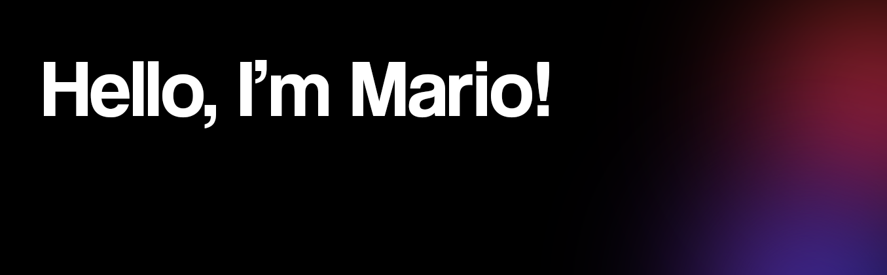
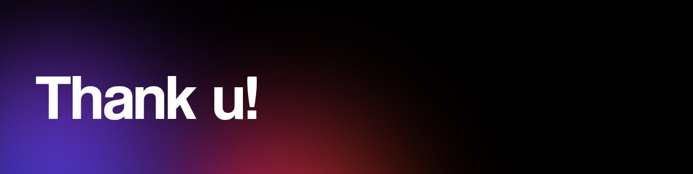

<h1>👨‍💻 I am a multimedia engineer, skilled in both programming and graphic design</h1>

 

 

A passionate Multimedia Engineer with a flair for blending technology and creativity. I specialize in programming, graphic design, and multimedia production, striving to create innovative and engaging digital experiences.

My expertise includes software development, UI/UX design, animation, and video editing. Beyond technical skills, I pride myself on being a problem-solver, a team player, and someone who communicates effectively to bring ideas to life.

I thrive on challenges and enjoy turning complex concepts into user-friendly solutions that not only meet but exceed expectations. Let’s create something amazing together!

 

1. Effective communication
2. Teamwork
3. Adaptability
4. Creativity
5. Problem-solving
6. Time management
7. Critical thinking
8. Organization
9. Leadership

 

<h3 align="left">📋 Languages</h3>

<h3 align="left"> 🎨 Design</h3>

<h3 align="left"> 📚 Frameworks</h3>

<h3>💾 Databases</h3>

<h3>⛓️‍💥 Other</h3>

